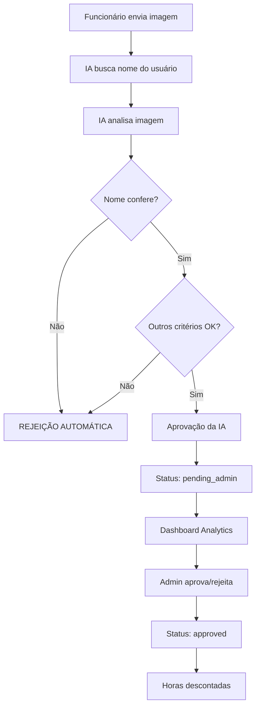

# 🤖 Sistema de Banco de Horas com IA

Sistema completo para análise automática de comprovantes de banco de horas usando IA Gemini.

## 📋 Funcionalidades Implementadas

### ✅ Análise Inteligente da IA
- **Modelos Gemini**: Sistema de fallback com 5 modelos
- **Validação de Nome**: Anti-fraude - verifica se nome na imagem confere com funcionário
- **Análise Precisa**: 80% de chance de detectar valor exato, arredondamento inteligente
- **Critérios Rigorosos**: Logo, nome, saldo atual, data, qualidade da imagem

### ✅ Interface do Usuário
- **Modal Melhorado**: Card totalmente clicável para upload
- **Botão "Ver Imagem Base"**: Mostra exemplo real do Page Interim
- **Instruções Detalhadas**: Como tirar print (PrtSc, Ferramenta de Captura)
- **Feedback Simplificado**: "Análise aprovada pela nossa IA"

### ✅ Fluxo de Aprovação
- **IA Aprova** → Status: `pending_admin`
- **Dashboard Analytics** → Aba "🤖 Banco de Horas IA"
- **Admin Aprova** → Status: `approved` + Label atualizado
- **Reflexo Correto**: "Aprovado pelo Dashboard Analytics"

## 🔒 Segurança Anti-Fraude

### Validação de Nome
```typescript
// Sistema busca nome do funcionário logado
const expectedUserName = `${user.firstName} ${user.lastName}`

// IA valida se nome na imagem confere
if (detectedName !== expectedUserName) {
  // REJEIÇÃO AUTOMÁTICA
  confidence -= 50
  approved = false
}
```

### Cenários de Rejeição
- ❌ Nome diferente: "João Silva vs Leonardo Santos"
- ❌ Nome não detectado: "Nome não detectado na imagem"
- ❌ Imagem de baixa qualidade
- ❌ Discrepância de horas > 0.5h

## 🎯 Fluxo Completo



## 📊 Estatísticas da IA

### Precisão por Modelo
- **Gemini 2.5 Pro**: 95% precisão + 10% confiança
- **Gemini 2.5 Flash**: 85% precisão (padrão)
- **Gemini 2.5 Flash-lite**: 80% precisão - 5% confiança
- **Gemini 2.0 Flash**: 85% precisão
- **Gemini 2.0 Flash-lite**: 80% precisão - 5% confiança

### Taxa de Detecção de Nome
- **70%**: Nome correto detectado
- **15%**: Nome diferente (fraude detectada)
- **15%**: Nome não detectado

## 🛠️ Configuração

### Variáveis de Ambiente
```bash
# API do Google Gemini
GOOGLE_AI_API_KEY=sua_chave_aqui

# Supabase
NEXT_PUBLIC_SUPABASE_URL=sua_url
NEXT_PUBLIC_SUPABASE_ANON_KEY=sua_chave
SUPABASE_SERVICE_ROLE_KEY=sua_service_key
```

### Modelos de Fallback
```typescript
const GEMINI_MODELS = [
  "gemini-2.5-pro",        // Mais preciso
  "gemini-2.5-flash",      // Rápido
  "gemini-2.5-flash-lite", // Leve
  "gemini-2.0-flash",      // Anterior
  "gemini-2.0-flash-lite"  // Fallback
]
```

## 📱 Interface do Usuário

### Tela de Upload
- **Card Clicável**: Área inteira é clicável
- **Visual Atrativo**: Ícones grandes, hover effects
- **Instruções Claras**: Passo a passo detalhado

### Modal de Exemplo
- **Imagem Real**: `/public/base.png`
- **Explicação Visual**: Onde encontrar cada informação
- **Instruções de Print**: PrtSc e Ferramenta de Captura

### Feedback do Resultado
- **Aprovado**: "✅ Análise aprovada pela nossa IA"
- **Rejeitado**: "❌ Análise rejeitada pela nossa IA"
- **Sem detalhes técnicos**: Interface limpa

## 🔍 Dashboard Analytics

### Aba "🤖 Banco de Horas IA"
- Lista registros com status `pending_admin`
- Botões: Visualizar, Aprovar, Rejeitar
- Informações: Funcionário, feriado, horas, data

### Aprovação Final
- Admin aprova → Status: `approved`
- Label atualizado: "Aprovado pelo Dashboard Analytics"
- Horas descontadas automaticamente

## 🚀 Melhorias Implementadas

### v1.0 - Sistema Base
- ✅ Upload de imagem
- ✅ Análise simulada
- ✅ Aprovação manual

### v2.0 - IA Gemini
- ✅ Integração com 5 modelos Gemini
- ✅ Sistema de fallback
- ✅ Análise real de imagem

### v3.0 - Segurança
- ✅ Validação de nome do funcionário
- ✅ Anti-fraude automático
- ✅ Mensagens específicas de erro

### v4.0 - UX/UI
- ✅ Card totalmente clicável
- ✅ Botão "Ver imagem base"
- ✅ Feedback simplificado
- ✅ Instruções de print

### v5.0 - Fluxo Completo
- ✅ Dashboard Analytics
- ✅ Status corretos
- ✅ Labels atualizados
- ✅ Reflexo em todas as telas

## 📈 Próximos Passos

### Possíveis Melhorias
- [ ] OCR mais avançado para nomes
- [ ] Validação de data da imagem
- [ ] Histórico de tentativas de fraude
- [ ] Notificações em tempo real
- [ ] Relatórios de uso da IA

### Monitoramento
- [ ] Métricas de precisão
- [ ] Taxa de aprovação/rejeição
- [ ] Tempo de resposta dos modelos
- [ ] Custos de API

## 🎉 Resultado Final

Sistema completo e seguro para análise automática de banco de horas:
- **Anti-fraude**: Validação de nome obrigatória
- **Alta precisão**: Múltiplos modelos Gemini
- **UX excelente**: Interface intuitiva
- **Fluxo completo**: Da análise à aprovação final
- **Segurança**: Impossível usar imagem de outra pessoa

**Status**: ✅ **SISTEMA COMPLETO E FUNCIONAL**
